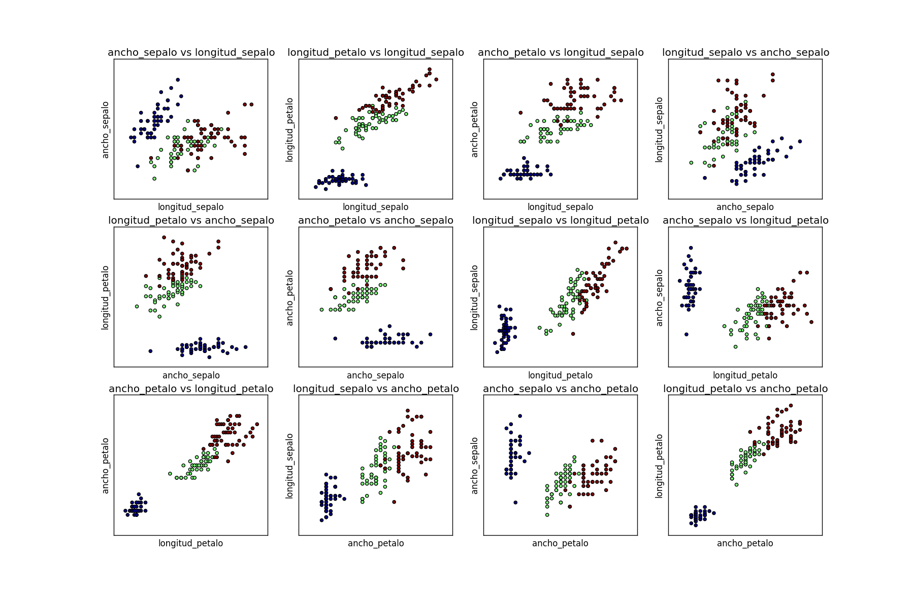

# Tutorial sobre `scikit-learn`
Este breve tutorial explica algunos de los conceptos relacionados con la librería `scikit-learn` de python. 

# ¿Qué es python?

- Python es un lenguaje de programación interpretado.
- Su nombre proviene de la afición de su creador original, [Guido van Rossum](https://es.wikipedia.org/wiki/Guido_van_Rossum), por los humoristas británicos [Monty Python](https://es.wikipedia.org/wiki/Monty_Python).
- Características:
  - Programación orientada a objetos
  - Programación imperativa
  - Programación funcional.
  - Es multiplataforma y posee una licencia abierta.

# Entornos de desarrollo para python

- Entornos de desarrollo para Python
  - [Sublime Text](http://www.sublimetext.com/)
  - [PyCharm](https://www.jetbrains.com/pycharm/)
  - [Spyder](https://github.com/spyder-ide/spyder)

# `scikit-learn`

- Librería que proporciona un amplio conjunto de algoritmos de aprendizaje supervisado y no supervisado a través de una consistente interfaz en `python`.
- Publicado bajo licencia BSD y distribuido en muchos sistemas Linux, favorece el uso comercial y educacional.
- Esta librería se ha construido sobre [`SciPy`](http://www.scipy.org/) (*Scientific Python*), que debe ser instalada antes de utilizarse, incluyendo:
  - [**NumPy**](http://www.numpy.org/)
  - [**Matplotlib**](http://matplotlib.org/)
  - [SymPy](https://simpy.readthedocs.org/en/latest/)
  - [**Pandas**](http://pandas.pydata.org/)


# Características de `scikit-learn`

- Esta librería se centra en el modelado de datos y no en cargar y manipular los dato, para lo que utilizaríamos [NumPy](http://www.numpy.org/) y [Pandas](http://pandas.pydata.org/). Algunas cosas que podemos hacer con `scikit-learn` son:
  - *Clustering*.
  - Validación cruzada.
  - *Datasets* de prueba.
  - Reducción de la dimensionalidad.
  - *Ensemble methods*.
  - *Feature selection*.
  - *Parameter tuning*.

Las principales ventajas de `scikit-learn` son las siguientes:
  - Interfaz consistente ante modelos de aprendizaje automático.
  - Proporciona muchos parámetros de configuración.
  - Documentación excepcional.
  - Desarrollo muy activo.
  - Comunidad.

# Ejemplos de uso con el *dataset* `iris`

Vamos a utilizar un ejemplo típico en *machine learning* que es la base de datos `iris`.  En esta base de datos hay tres clases a predecir, que son tres especies distintas de la flor iris, de manera que, para cada flor, se extraen cuatro medidas o variables de entrada (longitud y ancho de los pétalos y los sépalos, en cm). Las tres especies a distinguir son iris *setosa*, iris *virginica* e iris *versicolor*.

## Lectura de datos

Como ya hemos comentado, para la lectura de datos haremos uso de [Pandas](http://pandas.pydata.org/). Esta librería tiene un método `read_csv` que nos va a permitir leer los datos desde un fichero de texto `csv`. Veamos el código:
```python
import pandas as pd
import numpy as np
import matplotlib.pyplot as plt

from sklearn import neighbors
from sklearn import preprocessing
```
Con estas líneas, importamos la funcionalidad necesaria para el ejemplo. `pandas` nos permitirá leer los datos, `numpy` nos va a permitir trabajar con ellos de forma matricial, `matplotlib` nos permite hacer representaciones gráficas y, de la librería `scikit-learn`, en este caso, utilizaremos un método de clasificación basado en los vecinos más cercanos y algunas funciones de preprocesamiento.

El método `read_csv` de `pandas` permite dos modos de trabajo: que el propio fichero csv tenga una fila con los nombres de las variables o que nosotros especifiquemos los nombres de las variables en la llamada. En este caso, vamos a utilizar la segunda aproximación. De esta forma, creamos un *array* con los nombres de las variables:
```python
nombre_variables = ['longitud_sepalo', 'ancho_sepalo', 'longitud_petalo', 'ancho_petalo', 'clase']
```
y leemos el dataset con:
```python
iris = pd.read_csv('data/iris.csv', names = nombre_variables)
```
`iris` es un objeto de la clase [`DataFrame`](http://pandas.pydata.org/pandas-docs/stable/generated/pandas.DataFrame.html) de `pandas`.

## Inspección de datos

Antes de nada, es conveniente realizar una pequeña **inspección** de los datos. Si simplemente queremos ver la cabecera del dataset, podemos utilizar el método `head(n)`, que devuelve un DataFrame incluyendo los primeros `n` patrones:
```python
print iris.head(9)
```
Ahora vamos a utilizar una función para inspeccionar detenidamente cada par de variables y su relación con las etiquetas de clase. De esta forma, construiremos un gráfico de (3x4) subgráficos, que incluya, para cada par de variables, los 150 patrones, con un calor que indique la etiqueta de clase y donde las coordenadas x e y se correspondan con los valores de las variables afectadas. Esto se puede hacer con el siguiente código:
```python
def plot_dataset(dataset,nombre_variables):
    """ Función que pinta un dataset
    dataset es el DataFrame que vamos a utilizar para extraer los datos
    nombre_variables es el nombre de las variables de ese dataset
    * Supondremos que la última variable es la etiqueta de clase
    """
    # Numero de variables
    num_variables = dataset.shape[1]
    # Extraer la etiqueta de clase
    labels = dataset[nombre_variables[-1]]
    # Convertir la etiqueta a números enteros (1,2,3...)
    labelencoder = preprocessing.LabelEncoder()
    labelencoder.fit(labels)
    labels = labelencoder.transform(labels)
    # Número de plot
    plot_index = 1
    plt.figure(figsize=(18,12))
    plt.clf()
    for i in range(0,num_variables-1):
        for j in range(0,num_variables-1):
            if i != j:  
                # Extraer variables i y j
                x = dataset[nombre_variables[i]]
                y = dataset[nombre_variables[j]]
                # Elegir el subplot
                plt.subplot(num_variables-2, num_variables-1, plot_index)
                # Pintar los puntos
                plt.scatter(x, y, c=labels)
                # Etiquetas para los ejes
                plt.xlabel(nombre_variables[i])
                plt.ylabel(nombre_variables[j])
                # Título para el gráfico
                plt.title(nombre_variables[j]+" vs "+nombre_variables[i])
                # Extraer rangos de las variables y establecerlos
                x_min, x_max = x.min() - .5, x.max() + .5
                y_min, y_max = y.min() - .5, y.max() + .5
                plt.xlim(x_min, x_max)
                plt.ylim(y_min, y_max)
                # Que no se vean los ticks
                plt.xticks(())
                plt.yticks(())
                plot_index = plot_index + 1
    plt.show()
```

Si ahora queremos usar la función con el dataset iris, podemos llamarla de la siguiente forma:
```python
plot_dataset(iris,nombre_variables)
```
El resultado debería ser el siguiente:


## Manejo de objetos `DataFrame` y `ndarray`

Los DataFrame [`DataFrame`](http://pandas.pydata.org/pandas-docs/stable/generated/pandas.DataFrame.html) son objetos que representan a los *datasets* con los que vamos a operar. Permiten realizar muchas operaciones de forma automática, ayudando a transformar las variables de forma muy cómoda. Internamente, el dataset se guarda en un array bidimensional de `numpy` (clase [`ndarray`](http://docs.scipy.org/doc/numpy/reference/generated/numpy.ndarray.html)). El acceso a los elementos de un [`DataFrame`](http://pandas.pydata.org/pandas-docs/stable/generated/pandas.DataFrame.html) es algo más simple si utilizamos su versión [`ndarray`](http://docs.scipy.org/doc/numpy/reference/generated/numpy.ndarray.html), para lo cual simplemente tenemos que utilizar el atributo `values`:
```python
print iris['longitud_sepalo']
print iris[nombre_variables[0]]
iris_array = iris.values
print iris_array[:,0]
```
La sintaxis de indexación en un [`ndarray`](http://docs.scipy.org/doc/numpy/reference/generated/numpy.ndarray.html) es la siguiente:
- `array[i,j]`: accede al valor de la fila `i` columna `j`.
- `array[i:j,k]`: devuelve otro `ndarray` con la submatriz correspondiente a las filas desde la `i` hasta la `j-1` y a la columna `k`.
- `array[i:j,k:l]`: devuelve otro `ndarray` con la submatriz correspondiente a las filas desde la `i` hasta la `j-1` y a las columnas desde la `k` hasta la `l`.
- `array[i:j,:]`: devuelve otro `ndarray` con la submatriz correspondiente a las filas desde la `i` hasta la `j-1` y **todas** las columnas.
- `array[:,i:j]`: devuelve otro `ndarray` con la submatriz correspondiente a **todas** las filas y a las columnas desde la `k` hasta la `l`.
De esta forma:
```python
>>> iris_array[0:2,2:4]
array([[1.4, 0.2],
       [1.4, 0.2]], dtype=object)
>>> iris[0:2][nombre_variables[2:4]]
   longitud_petalo  ancho_petalo
0              1.4           0.2
1              1.4           0.2
>>> iris_array[1:6,:]
array([[4.9, 3.0, 1.4, 0.2, 'Iris-setosa'],
       [4.7, 3.2, 1.3, 0.2, 'Iris-setosa'],
       [4.6, 3.1, 1.5, 0.2, 'Iris-setosa'],
       [5.0, 3.6, 1.4, 0.2, 'Iris-setosa'],
       [5.4, 3.9, 1.7, 0.4, 'Iris-setosa']], dtype=object)
>>> iris[1:6][nombre_variables[:]]
   longitud_sepalo  ancho_sepalo  longitud_petalo  ancho_petalo        clase
1              4.9           3.0              1.4           0.2  Iris-setosa
2              4.7           3.2              1.3           0.2  Iris-setosa
3              4.6           3.1              1.5           0.2  Iris-setosa
4              5.0           3.6              1.4           0.2  Iris-setosa
5              5.4           3.9              1.7           0.4  Iris-setosa
```
Vemos que el acceso a través del `ndarray` es, por lo general, más cómodo, ya que no requerimos del nombre de las variables.

En `scikit-learn`, al igual que en otros lenguajes de programación como R o Matlab, debemos intentar, siempre que sea posible, *vectorizar* las operaciones. Esto es utilizar operaciones matriciales en lugar de bucles que recorran los arrays. La razón es que este tipo de operaciones están muchos más optimizadas y que el proceso de referenciación de *arrays* puede consumir mucho tiempo.

Imaginemos que queremos imprimir el área de sépalo de todas las flores. Compara la diferencia entre hacerlo mediante un bucle `for` y mediante operaciones matriciales:
```python
# Generar un array con el área del sépalo (longitud*anchura), utilizando un for
# Crear un array vacío
areaSepaloArray = np.empty(iris_array.shape[0]) # OJO paréntesis
for i in range(0,iris_array.shape[0]):
    areaSepaloArray[i] = iris_array[i,0] * iris_array[i,1]
print areaSepaloArray

# Generar un array con el área del sépalo (longitud*anchura), utilizando operaciones matriciales
# Crear un array vacío e inicializarlo a 0
print iris_array[:,0] * iris_array[:,1]
```

Es más, los `ndarray` permiten aplicar operaciones lógicas, que devuelven otro `ndarray` con el resultado de realizar esas operaciones lógicas:
```python
>>> iris_array[:,2] > 5
array([False, False, False, False, False, False, False, False, False,
       False, False, False, False, False, False, False, False, False,
       False, False, False, False, False, False, False, False, False,
       False, False, False, False, False, False, False, False, False,
       False, False, False, False, False, False, False, False, False,
       False, False, False, False, False, False, False, False, False,
       False, False, False, False, False, False, False, False, False,
       False, False, False, False, False, False, False, False, False,
       False, False, False, False, False, False, False, False, False,
       False, False,  True, False, False, False, False, False, False,
       False, False, False, False, False, False, False, False, False,
       False,  True,  True,  True,  True,  True,  True, False,  True,
        True,  True,  True,  True,  True, False,  True,  True,  True,
        True,  True, False,  True, False,  True, False,  True,  True,
       False, False,  True,  True,  True,  True,  True,  True,  True,
        True,  True,  True, False,  True,  True,  True,  True,  True,
        True,  True, False,  True,  True,  True], dtype=bool)
```
A su vez, este `ndarray` se puede usar para indexar el `ndarray` original:
```python
>>> iris_array[iris_array[:,2] > 5,4]
array(['Iris-versicolor', 'Iris-virginica', 'Iris-virginica',
       'Iris-virginica', 'Iris-virginica', 'Iris-virginica',
       'Iris-virginica', 'Iris-virginica', 'Iris-virginica',
       'Iris-virginica', 'Iris-virginica', 'Iris-virginica',
       'Iris-virginica', 'Iris-virginica', 'Iris-virginica',
       'Iris-virginica', 'Iris-virginica', 'Iris-virginica',
       'Iris-virginica', 'Iris-virginica', 'Iris-virginica',
       'Iris-virginica', 'Iris-virginica', 'Iris-virginica',
       'Iris-virginica', 'Iris-virginica', 'Iris-virginica',
       'Iris-virginica', 'Iris-virginica', 'Iris-virginica',
       'Iris-virginica', 'Iris-virginica', 'Iris-virginica',
       'Iris-virginica', 'Iris-virginica', 'Iris-virginica',
       'Iris-virginica', 'Iris-virginica', 'Iris-virginica',
       'Iris-virginica', 'Iris-virginica', 'Iris-virginica'], dtype=object)
```
Imagina que ahora queremos imprimir la longitud de sépalo de aquellas flores cuya longitud de sépalo es mayor que 2. Compara la versión con `for` y la versión "vectorizada":
```python
# Imprimir las longitudes de sépalo mayores que 2, utilizando un for
iris_array = iris.values
for i in range(0,iris_array.shape[0]):
    valorSepalo = iris_array[i,0]
    if valorSepalo > 2:
        print valorSepalo
        
# Imprimir las longitudes de sépalo mayores que 2, utilizando operaciones matriciales
print iris_array[ iris_array[:,0] > 2, 0]
```

Podemos usar algunas funciones adicionales sobre objetos de tipo `ndarray`. Por ejemplo, las funciones [`numpy.mean`](http://docs.scipy.org/doc/numpy/reference/generated/numpy.mean.html) y [`numpy.std`](http://docs.scipy.org/doc/numpy/reference/generated/numpy.std.html) nos sirven para calcular la media y la desviación típica, respectivamente, de los valores contenidos en el `ndarray` que se pasa como argumento.

Por último, podemos realizar operaciones matriciales con los `ndarray` de forma muy simple y optimizada. La función [`numpy.dot`](http://docs.scipy.org/doc/numpy/reference/generated/numpy.dot.html) multiplica dos `ndarray`, siempre que sus dimensiones sean compatibles. La función [`numpy.transpose`]
```python
>>> a = [[1, 0], [0, 1]]
>>> b = [[4, 1], [2, 2]]
>>> np.dot(a, b)
array([[4, 1],
       [2, 2]])
>>> x = np.arange(4).reshape((2,2))
>>> x
array([[0, 1],
       [2, 3]])
>>> np.transpose(x)
array([[0, 2],
       [1, 3]])
```

**Ejercicio**: Prueba a imprimir la media y la desviación típica del áreas de aquellas flores que son de tipo *virginica*.

## División de datos en entrenamiento y test

Aunque a veces nos proporcionan los datos ya divididos en los conjuntos de entrenamiento y test, conviene saber como podríamos realizar esta división. El siguiente código muestra una función que divide los datos de forma aleatoria, utilizando operaciones *vectorizadas*:
```python
def dividir_ent_test(dataframe, porcentaje=0.6):
    """ 
    Función que divide un dataframe aleatoriamente en entrenamiento y en test.
    Recibe los siguientes argumentos:
    - dataframe: DataFrame que vamos a utilizar para extraer los datos
    - porcentaje: porcentaje de patrones en entrenamiento
    Devuelve:
    - train: DataFrame con los datos de entrenamiento
    - test: DataFrame con los datos de test
    """
    mascara = np.random.rand(len(dataframe)) < porcentaje
    train = dataframe[mascara]
    test = dataframe[~mascara]
    return train, test

iris_train, iris_test = dividir_ent_test(iris)
```

Ahora, podemos quedarnos con las columnas correspondientes a las variables de entrada (todas salvo la última) y la correspondiente a la variable de salida (en este caso, la última):
```python
train_inputs_iris = iris_train.values[:,0:-1]
train_outputs_iris = iris_train.values[:,-1]
test_inputs_iris = iris_test.values[:,0:-1]
test_outputs_iris = iris_test.values[:,-1]
print train_inputs_iris.shape
```

## Labores de preprocesamiento

Sin embargo, `scikit-learn` no acepta cadenas como parámetros de las funciones, todo deben de ser números. Para ello, nos podemos valer del objeto [`sklearn.preprocessing.LabelEncoder`](http://scikit-learn.org/stable/modules/generated/sklearn.preprocessing.LabelEncoder.html), que nos transforma automáticamente de cadenas a números. La forma en que se utiliza es la siguiente:
```python
label_e = preprocessing.LabelEncoder()
label_e.fit(train_outputs_iris)
train_outputs_iris_encoded = label_e.transform(train_outputs_iris)
test_outputs_iris_encoded = label_e.transform(test_outputs_iris)
```
Como podéis observar, primero se crea el `LabelEncoder` y luego se "entrena" mediante el método `fit`. Para un `LabelEncoder`, "entrenar" el modelo es decidir el mapeo que vimos anteriormente, en este caso:
- `Iris-setosa` -> 0
- `Iris-versicolor` -> 1
- `Iris-virginica` -> 2
Una vez entrenado, utilizando el método `transform` del `LabelEncoder`, podremos transformar cualquier `ndarray` que queramos (en nuestro caso, tanto las salidas de entrenamiento como las de test, hubiéramos tenido un error si alguna de las etiquetas de test no estuviera en train). Esta estructura (método `fit` más método `transform` o `predict`) se repite en muchos de los objetos de `scikit-learn`.

Hay muchas más tareas de preprocesamiento que se pueden hacer en `scikit-learn`. Consulta el paquete [`sklearn.preprocessing`](http://scikit-learn.org/stable/modules/classes.html#module-sklearn.preprocessing).

## Crear y evaluar un clasificador

A continuación, vamos a crear un modelo de clasificación y a obtener su matriz de confusión. Vamos a utilizar el clasificador [KNeighborsClassifier](http://scikit-learn.org/stable/modules/generated/sklearn.neighbors.KNeighborsClassifier.html), que clasifica cada patrón asignándole la clase mayoritaria según los `k` vecinos más cercanos al patrón a clasificar. Consulta siempre la documentación de cada objeto para ver los parámetros del algoritmo (en este caso, el parámetro decisivo es `n_neighbors`). Veamos como se realizaría el entrenamiento:
```python
knn = neighbors.KNeighborsClassifier()
knn.fit(train_inputs_iris, train_outputs_iris_encoded)
print knn
```
Ya tenemos el modelo entrenado. Este modelo es de tipo *lazy*, en el sentido de que no existen parámetros a ajustar durante el entrenamiento. Lo único que hacemos es acomodar las entradas en una serie de estructuras de datos que faciliten el cálculo de distancias a la hora de predecir la etiqueta de datos nuevos. Si ahora queremos predecir las etiquetas de test, podemos hacer uso del método `predict`, que aplica el modelo ya entrenado a datos nuevos:
```python
prediccion_test = knn.predict(test_inputs_iris)
print prediccion_test
```
Si queremos saber que tan buena ha sido la clasificación, todo modelo de clasificación o regresión en `scikit-learn` tiene un método `score` que nos devuelve la bondad del modelo con respecto a los valores esperados, a partir de las entradas suministradas. La medida por defecto utilizada en [KNeighborsClassifier](http://scikit-learn.org/stable/modules/generated/sklearn.neighbors.KNeighborsClassifier.html) es el porcentaje de patrones bien clasificados (CCR o *accuracy*). La función se utiliza de la siguiente forma (internamente, esta función llama a `predict`):
```python
precision = knn.score(test_inputs_iris, test_outputs_iris_encoded)
```

Para imprimir la matriz de confusión de unas predicciones, podemos utilizar la función [`sklearn.metrics.confusion_matrix`](http://scikit-learn.org/stable/modules/generated/sklearn.metrics.confusion_matrix.html#sklearn.metrics.confusion_matrix), que nos va devolver la matriz ya formada:
```python
from sklearn.metrics import confusion_matrix
cm = confusion_matrix(test_outputs_iris_encoded, prediccion_test)
print cm
```

## Configurar los parámetros de un clasificador

Imagina que quieres configurar el número de vecinos más cercanos (`n_neighbors`), de forma que la precisión en entrenamiento. Lo podríamos hacer de la siguiente forma:
```python
for nn in range(1,15):
    knn = neighbors.KNeighborsClassifier(n_neighbors=nn)
    knn.fit(train_inputs_iris, train_outputs_iris_encoded)
    precisionTrain = knn.score(train_inputs_iris, train_outputs_iris_encoded)
    precisionTest = knn.score(test_inputs_iris, test_outputs_iris_encoded)
    print "%d vecinos: CCR train=%.2f, CCR test=%.2f" % (nn, precisionTrain*100, precisionTest*100)
```

# Referencias
- Python como alternativa a R en *machine learning*. Mario Pérez Esteso. [Enlace a Github](https://github.com/MarioPerezEsteso/Python-Machine-Learning). [Enlace a Youtube](https://www.youtube.com/watch?v=8yz4gWt7Klk). 
- *An introduction to machine learning with scikit-learn*. Documentación oficial de `scikit-learn`. [http://scikit-learn.org/stable/tutorial/basic/tutorial.html](http://scikit-learn.org/stable/tutorial/basic/tutorial.html).
- *A tutorial on statistical-learning for scientific data processing*. Documentación oficial de `scikit-learn`. [http://scikit-learn.org/stable/tutorial/statistical_inference/index.html](http://scikit-learn.org/stable/tutorial/statistical_inference/index.html).
