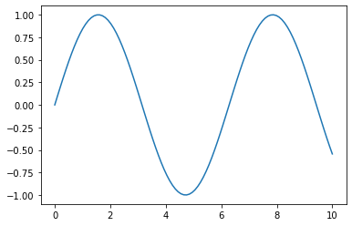
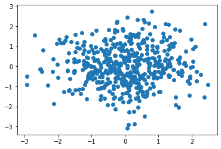
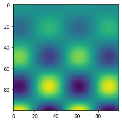
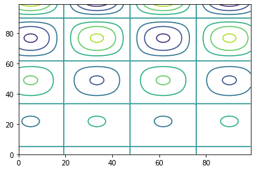
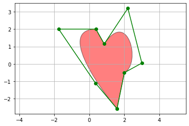
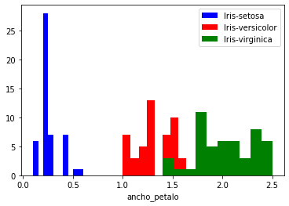
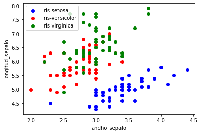
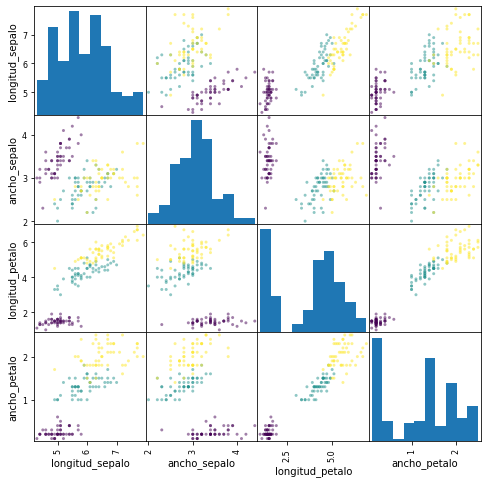

Este breve tutorial explica algunos de los conceptos relacionados con la librería `scikit-learn` de python. 

# ¿Qué es python?

- Python es un lenguaje de programación interpretado.
- Su nombre proviene de la afición de su creador original, [Guido van Rossum](https://es.wikipedia.org/wiki/Guido_van_Rossum), por los humoristas británicos [Monty Python](https://es.wikipedia.org/wiki/Monty_Python).
- Características:
  - Programación orientada a objetos
  - Programación imperativa
  - Programación funcional.
  - Es multiplataforma y posee una licencia abierta.

# Entornos de desarrollo para python

- Entornos de desarrollo para Python
  - [Sublime Text](http://www.sublimetext.com/)
  - [PyCharm](https://www.jetbrains.com/pycharm/)
  - [Spyder](https://github.com/spyder-ide/spyder)
  - [Visual Studio Code](https://code.visualstudio.com/)

# `scikit-learn`

- Librería que proporciona un amplio conjunto de algoritmos de aprendizaje supervisado y no supervisado a través de una consistente interfaz en `python`.
- Publicado bajo licencia BSD y distribuido en muchos sistemas Linux, favorece el uso comercial y educacional.
- Esta librería se ha construido sobre [`SciPy`](http://www.scipy.org/) (*Scientific Python*), que debe ser instalada antes de utilizarse, incluyendo:
  - [**NumPy**](http://www.numpy.org/)
  - [**Matplotlib**](http://matplotlib.org/)
  - [SymPy](https://simpy.readthedocs.org/en/latest/)
  - [**Pandas**](http://pandas.pydata.org/)

# Características de `scikit-learn`

- Esta librería se centra en el modelado de datos y no en cargar y manipular los datos, para lo que utilizaríamos [NumPy](http://www.numpy.org/) y [Pandas](http://pandas.pydata.org/). Algunas cosas que podemos hacer con `scikit-learn` son:
  - *Clustering*.
  - Validación cruzada.
  - *Datasets* de prueba.
  - Reducción de la dimensionalidad.
  - *Ensemble methods*.
  - *Feature selection*.
  - *Parameter tuning*.

Las principales ventajas de `scikit-learn` son las siguientes:
  - Interfaz consistente ante modelos de aprendizaje automático.
  - Proporciona muchos parámetros de configuración.
  - Documentación excepcional.
  - Desarrollo muy activo.
  - Comunidad.

Jupyter Notebooks (libros de notas o cuadernos Jupyter)
==================

* Puedes ejecutar un `Cell` (celda) pulsando ``[shift] + [Enter]`` o presionando el botón `Play` en la barra de herramientas.


* Puedes obtener ayuda sobre una función u objeto presionando ``[shift] + [tab]`` después de los paréntesis de apertura ``function(``


* También puedes obtener la ayuda ejecutando ``function?``


# Importación de librerías


```python
import pandas as pd
import numpy as np
import matplotlib.pyplot as plt

from sklearn import neighbors
from sklearn import preprocessing
```

Con estas líneas, importamos la funcionalidad necesaria para el ejemplo. `pandas` nos permitirá leer los datos, `numpy` nos va a permitir trabajar con ellos de forma matricial, `matplotlib` nos permite hacer representaciones gráficas y, de la librería `scikit-learn`, en este caso, utilizaremos un método de clasificación basado en los vecinos más cercanos y algunas funciones de preprocesamiento.

## matplotlib

Una parte muy importante del aprendizaje automático es la visualización de datos. La herramienta más habitual para esto en Python es [`matplotlib`](http://matplotlib.org). Es un paquete extremadamente flexible y ahora veremos algunos elementos básicos.

Ya que estamos usando los libros (*notebooks*) Jupyter, vamos a usar una de las [funciones mágicas](https://ipython.org/ipython-doc/3/interactive/magics.html) que vienen incluidas en IPython, el modo "*matoplotlib inline*", que dibujará los *plots* directamente en el libro.


```python
%matplotlib inline
```


```python
import matplotlib.pyplot as plt
```


```python
# Dibujar una línea
x = np.linspace(0, 10, 100)
plt.plot(x, np.sin(x));
```





En Python, por norma general, no es necesario utilizar ';' al finalizar cada sentencia, no obstante al dibujar *inline* una gráfica podemos usar ';' para evitar la salida real de *matplotlib* y que se muestre solamente la figura.
Prueba a ejecutar la la caja anterior quitando el ';' a la última sentencia. ¿Qué diferencia aprecias?


```python
# Dibujar un scatter (dispersión)
x = np.random.normal(size=500)
y = np.random.normal(size=500)
plt.scatter(x, y);
```





```python
# Mostrar imágenes usando imshow
# - Tener en cuenta que el origen por defecto está arriba a la izquierda

x = np.linspace(1, 12, 100)
y = x[:, np.newaxis]
```

El método de numpy *np.newaxis* crea un nuevo eje. Prueba a imprimir la dimensión de `x` e `y` usando el método de numpy `.shape`, ¿ves la diferencia?


```python
im = y * np.sin(x) * np.cos(y)
print(im.shape)

plt.imshow(im);
```

    (100, 100)





¿Qué estamos viendo en esta imagen?

No es más que un corte transversal del cruce de la función seno y la función coseno.

Si tienes dudas, siempre puedes [preguntarle a Google](https://www.google.es/search?dcr=0&ei=cGr8WbKFNsmTa_b1n6AI&q=sin%28x%29*cos%28y%29+from+-6+to+6&oq=sin%28x%29*cos%28y%29+from+-6+to+6&gs_l=psy-ab.3...5574.8328.0.8486.6.5.1.0.0.0.79.355.5.5.0....0...1.1.64.psy-ab..0.0.0....0.3Kq-XpUPDRs)


```python
# Hacer un diagrama de curvas de nivel (contour plot)
# - El origen aquí está abajo a la izquierda
plt.contour(im);
```





```python
# El modo "notebook" en lugar de inline permite que los plots sean interactivos
#%matplotlib inline
# Plot en 3D
from mpl_toolkits.mplot3d import Axes3D
ax = plt.axes(projection='3d')
xgrid, ygrid = np.meshgrid(x, y.ravel())
ax.plot_surface(xgrid, ygrid, im, cmap=plt.cm.viridis, cstride=2, rstride=2, linewidth=0);
```


Hay muchísimos tipos de gráficos disponibles. Una forma útila de explorarlos es mirar la [galería de matplotlib](http://matplotlib.org/gallery.html).

Prueba alguno de estos ejemplos. Por ejemplo, `https://matplotlib.org/mpl_examples/shapes_and_collections/path_patch_demo.py`:


```python
"""
Demo of a PathPatch object.
"""
import matplotlib.path as mpath
import matplotlib.patches as mpatches
import matplotlib.pyplot as plt


fig, ax = plt.subplots()

Path = mpath.Path
path_data = [
    (Path.MOVETO, (1.58, -2.57)),
    (Path.CURVE4, (0.35, -1.1)),
    (Path.CURVE4, (-1.75, 2.0)),
    (Path.CURVE4, (0.375, 2.0)),
    (Path.LINETO, (0.85, 1.15)),
    (Path.CURVE4, (2.2, 3.2)),
    (Path.CURVE4, (3, 0.05)),
    (Path.CURVE4, (2.0, -0.5)),
    (Path.CLOSEPOLY, (1.58, -2.57)),
    ]
codes, verts = zip(*path_data)
path = mpath.Path(verts, codes)
patch = mpatches.PathPatch(path, facecolor='r', alpha=0.5)
ax.add_patch(patch)

# plot control points and connecting lines
x, y = zip(*path.vertices)
line, = ax.plot(x, y, 'go-')

ax.grid()
ax.axis('equal')
plt.show()

```





# Ejemplos de uso con el *dataset* `iris`

Vamos a utilizar un ejemplo típico en *machine learning* que es la base de datos `iris`.  En esta base de datos hay tres clases a predecir, que son tres especies distintas de la flor iris, de manera que, para cada flor, se extraen cuatro medidas o variables de entrada (longitud y ancho de los pétalos y los sépalos, en cm). Las tres especies a distinguir son iris *setosa*, iris *virginica* e iris *versicolor*.

## Lectura de datos

Como ya hemos comentado, para la lectura de datos haremos uso de [Pandas](http://pandas.pydata.org/). Esta librería tiene un método `read_csv` que nos va a permitir leer los datos desde un fichero de texto `csv`.

El método `read_csv` de `pandas` permite dos modos de trabajo: que el propio fichero csv tenga una fila con los nombres de las variables o que nosotros especifiquemos los nombres de las variables en la llamada. En este caso, vamos a utilizar la segunda aproximación. De esta forma, creamos un *array* con los nombres de las variables:


```python
nombre_variables = ['longitud_sepalo', 'ancho_sepalo', 'longitud_petalo', 'ancho_petalo', 'clase']
```

y leemos el dataset con:


```python
iris = pd.read_csv('https://raw.githubusercontent.com/ayrna/tutorial-scikit-learn-IMC/master/data/iris.csv', names = nombre_variables)
```

`iris` es un objeto de la clase [`DataFrame`](http://pandas.pydata.org/pandas-docs/stable/generated/pandas.DataFrame.html) de `pandas`. También podríamos haber obviado el nombre de las columnas estableciendo `header=None`, de forma que `read_csv` le hubiera asignado un nombre por defecto.

## Inspección de datos

Antes de nada, es conveniente realizar una pequeña **inspección** de los datos. Si simplemente queremos ver la cabecera del dataset, podemos utilizar el método `head(n)`, que devuelve un DataFrame incluyendo los primeros `n` patrones:


```python
print(iris.head(9))
```

       longitud_sepalo  ancho_sepalo  longitud_petalo  ancho_petalo        clase
    0              5.1           3.5              1.4           0.2  Iris-setosa
    1              4.9           3.0              1.4           0.2  Iris-setosa
    2              4.7           3.2              1.3           0.2  Iris-setosa
    3              4.6           3.1              1.5           0.2  Iris-setosa
    4              5.0           3.6              1.4           0.2  Iris-setosa
    5              5.4           3.9              1.7           0.4  Iris-setosa
    6              4.6           3.4              1.4           0.3  Iris-setosa
    7              5.0           3.4              1.5           0.2  Iris-setosa
    8              4.4           2.9              1.4           0.2  Iris-setosa


Estos datos tienen cuatro dimensiones, pero podemos visualizar una o dos de las dimensiones usando un histograma o un scatter. Primero, activamos el *matplotlib inline mode*:


```python
%matplotlib inline
import matplotlib.pyplot as plt
```


```python
variable_x = 3
colors = ['blue', 'red', 'green']
iris_target_names = np.unique(iris['clase'])

for indice, color in zip(range(len(iris_target_names)), colors): #¿qué hace zip?
    #Separamos el conjunto en las distintas clases
    patrones = (iris['clase']==iris_target_names[indice]) #esta comparación la explicaremos más adelante
    plt.hist(iris.values[patrones, variable_x], label=iris_target_names[indice], color=color)

plt.xlabel(nombre_variables[variable_x])
plt.legend(loc='upper right')
plt.show()
```





Recuerda que las variables de entrada eran *['longitud_sepalo', 'ancho_sepalo', 'longitud_petalo', 'ancho_petalo', 'clase']*, sabiendo esto, ¿qué debemos modificar  en el código superior para mostrar la longitud del sépalo? 

A continuación vamos a representar en un gráfico la relación entre dos variables de entrada, así podremos ver si los patrones tienen algunas características que nos ayuden a crear un modelo lineal. Prueba distintas combinaciones de variables que se representan en los ejes, para ello modifica los valores de *vairable_x* y *variable_y*.


```python
variable_x = 1 
variable_y = 0

colors = ['blue', 'red', 'green']

for indice, color in zip(range(len(iris_target_names)), colors): #¿qué hace zip?
    patrones = (iris['clase']==iris_target_names[indice])
    plt.scatter(iris.values[patrones, variable_x], 
                iris.values[patrones, variable_y],
                label=iris_target_names[indice],
                c=color)

plt.xlabel(nombre_variables[variable_x])
plt.ylabel(nombre_variables[variable_y])
plt.legend(loc='upper left')
plt.show()
```





¿Has encontrado alguna combinación que haga que los datos sean linealmente separables?
Es un poco tedioso probar todas las posibles combinaciones, ¡y eso que en este ejemplo tenemos pocas variables!

### Matrices scatterplot

En lugar de realizar los plots por separado, una herramienta común que utilizan los analistas son las **matrices scatterplot**.

Estas matrices muestran los scatter plots entre todas las características del dataset, así como los histogramas para ver la distribución de cada característica.


```python
import pandas as pd
from sklearn import preprocessing
from pkg_resources import parse_version
le = preprocessing.LabelEncoder()
le.fit(iris['clase'])
clases_numeros = le.transform(iris['clase'])

iris_df = pd.DataFrame(iris[nombre_variables], columns=nombre_variables)

#Para versiones de pandas>0.16 se debe llamar al método como pd.plotting.scatter_matrix
if(parse_version(pd.__version__) > parse_version('0.16')):
    pd.plotting.scatter_matrix(iris_df, c=clases_numeros, figsize=(8, 8));
else:
    pd.tools.plotting.scatter_matrix(iris_df, c=clases_numeros, figsize=(8, 8));

```





## Manejo de objetos `DataFrame` y matrices numpy (`ndarray`)

Los [`DataFrame`](http://pandas.pydata.org/pandas-docs/stable/generated/pandas.DataFrame.html) son objetos que representan a los *datasets* con los que vamos a operar. Permiten realizar muchas operaciones de forma automática, ayudando a transformar las variables de forma muy cómoda. Internamente, el dataset se guarda en un array bidimensional de `numpy` (clase [`ndarray`](http://docs.scipy.org/doc/numpy/reference/generated/numpy.ndarray.html)). El acceso a los elementos de un [`DataFrame`](http://pandas.pydata.org/pandas-docs/stable/generated/pandas.DataFrame.html) es algo más simple si utilizamos su versión [`ndarray`](http://docs.scipy.org/doc/numpy/reference/generated/numpy.ndarray.html), para lo cual simplemente tenemos que utilizar el atributo `values`:


```python
print(iris['longitud_sepalo'])
```

    0      5.1
    1      4.9
    2      4.7
    3      4.6
    4      5.0
          ... 
    145    6.7
    146    6.3
    147    6.5
    148    6.2
    149    5.9
    Name: longitud_sepalo, Length: 150, dtype: float64


```python
print(iris[nombre_variables[0]])
```

    0      5.1
    1      4.9
    2      4.7
    3      4.6
    4      5.0
          ... 
    145    6.7
    146    6.3
    147    6.5
    148    6.2
    149    5.9
    Name: longitud_sepalo, Length: 150, dtype: float64


```python
iris_array = iris.values
print(iris_array[:,0])
```

    [5.1 4.9 4.7 4.6 5.0 5.4 4.6 5.0 4.4 4.9 5.4 4.8 4.8 4.3 5.8 5.7 5.4 5.1
     5.7 5.1 5.4 5.1 4.6 5.1 4.8 5.0 5.0 5.2 5.2 4.7 4.8 5.4 5.2 5.5 4.9 5.0
     5.5 4.9 4.4 5.1 5.0 4.5 4.4 5.0 5.1 4.8 5.1 4.6 5.3 5.0 7.0 6.4 6.9 5.5
     6.5 5.7 6.3 4.9 6.6 5.2 5.0 5.9 6.0 6.1 5.6 6.7 5.6 5.8 6.2 5.6 5.9 6.1
     6.3 6.1 6.4 6.6 6.8 6.7 6.0 5.7 5.5 5.5 5.8 6.0 5.4 6.0 6.7 6.3 5.6 5.5
     5.5 6.1 5.8 5.0 5.6 5.7 5.7 6.2 5.1 5.7 6.3 5.8 7.1 6.3 6.5 7.6 4.9 7.3
     6.7 7.2 6.5 6.4 6.8 5.7 5.8 6.4 6.5 7.7 7.7 6.0 6.9 5.6 7.7 6.3 6.7 7.2
     6.2 6.1 6.4 7.2 7.4 7.9 6.4 6.3 6.1 7.7 6.3 6.4 6.0 6.9 6.7 6.9 5.8 6.8
     6.7 6.7 6.3 6.5 6.2 5.9]


La sintaxis de indexación en un [`ndarray`](http://docs.scipy.org/doc/numpy/reference/generated/numpy.ndarray.html) es la siguiente:
- `array[i,j]`: accede al valor de la fila `i` columna `j`.
- `array[i:j,k]`: devuelve otro `ndarray` con la submatriz correspondiente a las filas desde la `i` hasta la `j-1` y a la columna `k`.
- `array[i:j,k:l]`: devuelve otro `ndarray` con la submatriz correspondiente a las filas desde la `i` hasta la `j-1` y a las columnas desde la `k` hasta la `l`.
- `array[i:j,:]`: devuelve otro `ndarray` con la submatriz correspondiente a las filas desde la `i` hasta la `j-1` y **todas** las columnas.
- `array[:,i:j]`: devuelve otro `ndarray` con la submatriz correspondiente a **todas** las filas y a las columnas desde la `k` hasta la `l`.
De esta forma:


```python
# Mostrar el array es menos bonito
iris_array[0:2,2:4]
```


    array([[1.4, 0.2],
           [1.4, 0.2]], dtype=object)


```python
# Mostrar el "pandas" siempre es vistoso
iris[0:2][nombre_variables[2:4]]
```


<div>
<style scoped>
    .dataframe tbody tr th:only-of-type {
        vertical-align: middle;
    }

    .dataframe tbody tr th {
        vertical-align: top;
    }

    .dataframe thead th {
        text-align: right;
    }
</style>
<table border="1" class="dataframe">
  <thead>
    <tr style="text-align: right;">
      <th></th>
      <th>longitud_petalo</th>
      <th>ancho_petalo</th>
    </tr>
  </thead>
  <tbody>
    <tr>
      <th>0</th>
      <td>1.4</td>
      <td>0.2</td>
    </tr>
    <tr>
      <th>1</th>
      <td>1.4</td>
      <td>0.2</td>
    </tr>
  </tbody>
</table>
</div>


```python
iris_array[1:6,:]
```


    array([[4.9, 3.0, 1.4, 0.2, 'Iris-setosa'],
           [4.7, 3.2, 1.3, 0.2, 'Iris-setosa'],
           [4.6, 3.1, 1.5, 0.2, 'Iris-setosa'],
           [5.0, 3.6, 1.4, 0.2, 'Iris-setosa'],
           [5.4, 3.9, 1.7, 0.4, 'Iris-setosa']], dtype=object)


```python
iris[1:6][nombre_variables[:]]
```


<div>
<style scoped>
    .dataframe tbody tr th:only-of-type {
        vertical-align: middle;
    }

    .dataframe tbody tr th {
        vertical-align: top;
    }

    .dataframe thead th {
        text-align: right;
    }
</style>
<table border="1" class="dataframe">
  <thead>
    <tr style="text-align: right;">
      <th></th>
      <th>longitud_sepalo</th>
      <th>ancho_sepalo</th>
      <th>longitud_petalo</th>
      <th>ancho_petalo</th>
      <th>clase</th>
    </tr>
  </thead>
  <tbody>
    <tr>
      <th>1</th>
      <td>4.9</td>
      <td>3.0</td>
      <td>1.4</td>
      <td>0.2</td>
      <td>Iris-setosa</td>
    </tr>
    <tr>
      <th>2</th>
      <td>4.7</td>
      <td>3.2</td>
      <td>1.3</td>
      <td>0.2</td>
      <td>Iris-setosa</td>
    </tr>
    <tr>
      <th>3</th>
      <td>4.6</td>
      <td>3.1</td>
      <td>1.5</td>
      <td>0.2</td>
      <td>Iris-setosa</td>
    </tr>
    <tr>
      <th>4</th>
      <td>5.0</td>
      <td>3.6</td>
      <td>1.4</td>
      <td>0.2</td>
      <td>Iris-setosa</td>
    </tr>
    <tr>
      <th>5</th>
      <td>5.4</td>
      <td>3.9</td>
      <td>1.7</td>
      <td>0.4</td>
      <td>Iris-setosa</td>
    </tr>
  </tbody>
</table>
</div>


Vemos que el acceso a través del `ndarray` es, por lo general, más cómodo, ya que no requerimos del nombre de las variables. Ahora vamos a manejar una matriz de valores aleatorios, para ver algunas características adicionales.


```python
import numpy as np

# Semilla de números aleatorios (para reproducibilidad)
rnd = np.random.RandomState(seed=123)

# Generar una matriz aleatoria
X = rnd.uniform(low=0.0, high=1.0, size=(3, 5))  # dimensiones 3x5

print(X)
```

    [[0.69646919 0.28613933 0.22685145 0.55131477 0.71946897]
     [0.42310646 0.9807642  0.68482974 0.4809319  0.39211752]
     [0.34317802 0.72904971 0.43857224 0.0596779  0.39804426]]


(tened en cuenta que los arrays en numpy se indexan desde el 0, al igual que la mayoría de estructuras en Python)


```python
# Acceder a los elementos

# Obtener un único elemento
# (primera fila, primera columna)
print(X[0, 0])

# Obtener una fila
# (segunda fila)
print(X[1])

# Obtener una columna
# (segunda columna)
print(X[:, 1])
```

    0.6964691855978616
    [0.42310646 0.9807642  0.68482974 0.4809319  0.39211752]
    [0.28613933 0.9807642  0.72904971]


$$\begin{bmatrix}
    1 & 2 & 3 & 4 \\
    5 & 6 & 7 & 8
\end{bmatrix}^T
= 
\begin{bmatrix}
    1 & 5 \\
    2 & 6 \\
    3 & 7 \\
    4 & 8
\end{bmatrix}
$$


```python
# Obtener la traspuesta
print(X.T)
```

    [[0.69646919 0.42310646 0.34317802]
     [0.28613933 0.9807642  0.72904971]
     [0.22685145 0.68482974 0.43857224]
     [0.55131477 0.4809319  0.0596779 ]
     [0.71946897 0.39211752 0.39804426]]


```python
# Crear un vector fila de números con la misma separación
# sobre un intervalo prefijado
y = np.linspace(start=0, stop=12, num=5)
print(y)
```

    [ 0.  3.  6.  9. 12.]


```python
# Transformar el vector fila en un vector columna
print(y[:, np.newaxis])
```

    [[ 0.]
     [ 3.]
     [ 6.]
     [ 9.]
     [12.]]


```python
# Obtener la forma de un array y cambiarla

# Generar un array aleatorio
rnd = np.random.RandomState(seed=123)
X = rnd.uniform(low=0.0, high=1.0, size=(3, 5))  # a 3 x 5 array

print(X)
print(X.shape)
print(X.reshape(5, 3))
```

    [[0.69646919 0.28613933 0.22685145 0.55131477 0.71946897]
     [0.42310646 0.9807642  0.68482974 0.4809319  0.39211752]
     [0.34317802 0.72904971 0.43857224 0.0596779  0.39804426]]
    (3, 5)
    [[0.69646919 0.28613933 0.22685145]
     [0.55131477 0.71946897 0.42310646]
     [0.9807642  0.68482974 0.4809319 ]
     [0.39211752 0.34317802 0.72904971]
     [0.43857224 0.0596779  0.39804426]]


```python
# Indexar según un conjunto de números enteros
indices = np.array([3, 1, 0])
print(indices)
X[:, indices]
```

    [3 1 0]


    array([[0.55131477, 0.28613933, 0.69646919],
           [0.4809319 , 0.9807642 , 0.42310646],
           [0.0596779 , 0.72904971, 0.34317802]])


## Vectorización de operaciones

En `scikit-learn`, al igual que en otros lenguajes de programación como R o Matlab, debemos intentar, siempre que sea posible, *vectorizar* las operaciones. Esto es utilizar operaciones matriciales en lugar de bucles que recorran los arrays. La razón es que este tipo de operaciones están muchos más optimizadas y que el proceso de referenciación de *arrays* puede consumir mucho tiempo.

Imaginemos que queremos imprimir el área de sépalo de todas las flores. Compara la diferencia entre hacerlo mediante un bucle `for` y mediante operaciones matriciales:


```python
# Generar un array con el área del sépalo (longitud*anchura), utilizando un for:

# Crear un array vacío
areaSepaloArray = np.empty(iris_array.shape[0])

# Bucle for 
for i in range(iris_array.shape[0]):
    areaSepaloArray[i] = iris_array[i,0] * iris_array[i,1]
    
print(areaSepaloArray)
```

    [17.85 14.7  15.04 14.26 18.   21.06 15.64 17.   12.76 15.19 19.98 16.32
     14.4  12.9  23.2  25.08 21.06 17.85 21.66 19.38 18.36 18.87 16.56 16.83
     16.32 15.   17.   18.2  17.68 15.04 14.88 18.36 21.32 23.1  15.19 16.
     19.25 15.19 13.2  17.34 17.5  10.35 14.08 17.5  19.38 14.4  19.38 14.72
     19.61 16.5  22.4  20.48 21.39 12.65 18.2  15.96 20.79 11.76 19.14 14.04
     10.   17.7  13.2  17.69 16.24 20.77 16.8  15.66 13.64 14.   18.88 17.08
     15.75 17.08 18.56 19.8  19.04 20.1  17.4  14.82 13.2  13.2  15.66 16.2
     16.2  20.4  20.77 14.49 16.8  13.75 14.3  18.3  15.08 11.5  15.12 17.1
     16.53 17.98 12.75 15.96 20.79 15.66 21.3  18.27 19.5  22.8  12.25 21.17
     16.75 25.92 20.8  17.28 20.4  14.25 16.24 20.48 19.5  29.26 20.02 13.2
     22.08 15.68 21.56 17.01 22.11 23.04 17.36 18.3  17.92 21.6  20.72 30.02
     17.92 17.64 15.86 23.1  21.42 19.84 18.   21.39 20.77 21.39 15.66 21.76
     22.11 20.1  15.75 19.5  21.08 17.7 ]


```python
# Generar un array con el área del sépalo (longitud*anchura), utilizando operaciones matriciales
areaSepaloArray_2 = iris_array[:,0] * iris_array[:,1]
print (areaSepaloArray_2)
```

    [17.849999999999998 14.700000000000001 15.040000000000001 14.26 18.0
     21.060000000000002 15.639999999999999 17.0 12.76 15.190000000000001
     19.980000000000004 16.32 14.399999999999999 12.899999999999999 23.2
     25.080000000000002 21.060000000000002 17.849999999999998 21.66 19.38
     18.36 18.87 16.56 16.83 16.32 15.0 17.0 18.2 17.68 15.040000000000001
     14.879999999999999 18.36 21.32 23.1 15.190000000000001 16.0 19.25
     15.190000000000001 13.200000000000001 17.34 17.5 10.35 14.080000000000002
     17.5 19.38 14.399999999999999 19.38 14.719999999999999 19.61 16.5
     22.400000000000002 20.480000000000004 21.39 12.649999999999999 18.2
     15.959999999999999 20.79 11.76 19.139999999999997 14.040000000000001 10.0
     17.700000000000003 13.200000000000001 17.689999999999998 16.24 20.77
     16.799999999999997 15.66 13.640000000000002 14.0 18.880000000000003 17.08
     15.75 17.08 18.56 19.799999999999997 19.04 20.1 17.4 14.82 13.2 13.2
     15.66 16.200000000000003 16.200000000000003 20.4 20.77 14.489999999999998
     16.799999999999997 13.75 14.3 18.299999999999997 15.08 11.5 15.12 17.1
     16.53 17.98 12.75 15.959999999999999 20.79 15.66 21.299999999999997 18.27
     19.5 22.799999999999997 12.25 21.169999999999998 16.75 25.92 20.8 17.28
     20.4 14.25 16.24 20.480000000000004 19.5 29.259999999999998 20.02
     13.200000000000001 22.080000000000002 15.679999999999998 21.56 17.01
     22.11 23.040000000000003 17.36 18.299999999999997 17.919999999999998 21.6
     20.72 30.02 17.919999999999998 17.639999999999997 15.86 23.1
     21.419999999999998 19.840000000000003 18.0 21.39 20.77 21.39 15.66 21.76
     22.11 20.1 15.75 19.5 21.08 17.700000000000003]


Es más, los `ndarray` permiten aplicar operaciones lógicas, que devuelven otro `ndarray` con el resultado de realizar esas operaciones lógicas:
¿Qué patrones tienen la longitud del pétalo (variable 2) mayor a 5 unidades?


```python
iris_array[:,2] > 5
```


    array([False, False, False, False, False, False, False, False, False,
           False, False, False, False, False, False, False, False, False,
           False, False, False, False, False, False, False, False, False,
           False, False, False, False, False, False, False, False, False,
           False, False, False, False, False, False, False, False, False,
           False, False, False, False, False, False, False, False, False,
           False, False, False, False, False, False, False, False, False,
           False, False, False, False, False, False, False, False, False,
           False, False, False, False, False, False, False, False, False,
           False, False,  True, False, False, False, False, False, False,
           False, False, False, False, False, False, False, False, False,
           False,  True,  True,  True,  True,  True,  True, False,  True,
            True,  True,  True,  True,  True, False,  True,  True,  True,
            True,  True, False,  True, False,  True, False,  True,  True,
           False, False,  True,  True,  True,  True,  True,  True,  True,
            True,  True,  True, False,  True,  True,  True,  True,  True,
            True,  True, False,  True,  True,  True])


A su vez, este `ndarray` se puede usar para indexar el `ndarray` original:
¿cuál es la clase de los patrones que tienen la longitud del pétalo mayor que 5 unidades?


```python
iris_array[iris_array[:,2] > 5,4]
```


    array(['Iris-versicolor', 'Iris-virginica', 'Iris-virginica',
           'Iris-virginica', 'Iris-virginica', 'Iris-virginica',
           'Iris-virginica', 'Iris-virginica', 'Iris-virginica',
           'Iris-virginica', 'Iris-virginica', 'Iris-virginica',
           'Iris-virginica', 'Iris-virginica', 'Iris-virginica',
           'Iris-virginica', 'Iris-virginica', 'Iris-virginica',
           'Iris-virginica', 'Iris-virginica', 'Iris-virginica',
           'Iris-virginica', 'Iris-virginica', 'Iris-virginica',
           'Iris-virginica', 'Iris-virginica', 'Iris-virginica',
           'Iris-virginica', 'Iris-virginica', 'Iris-virginica',
           'Iris-virginica', 'Iris-virginica', 'Iris-virginica',
           'Iris-virginica', 'Iris-virginica', 'Iris-virginica',
           'Iris-virginica', 'Iris-virginica', 'Iris-virginica',
           'Iris-virginica', 'Iris-virginica', 'Iris-virginica'], dtype=object)


Imagina que ahora queremos imprimir la longitud de sépalo de aquellas flores cuya longitud de sépalo es mayor que 2. Compara la versión con `for` y la versión "vectorizada":


```python
# Imprimir las longitudes de sépalo mayores que 2, utilizando un for
iris_array = iris.values
for i in range(0,iris_array.shape[0]):
    valorSepalo = iris_array[i,0]
    if valorSepalo > 2:
        print(valorSepalo)
```

    5.1
    4.9
    4.7
    4.6
    5.0
    5.4
    4.6
    5.0
    4.4
    4.9
    5.4
    4.8
    4.8
    4.3
    5.8
    5.7
    5.4
    5.1
    5.7
    5.1
    5.4
    5.1
    4.6
    5.1
    4.8
    5.0
    5.0
    5.2
    5.2
    4.7
    4.8
    5.4
    5.2
    5.5
    4.9
    5.0
    5.5
    4.9
    4.4
    5.1
    5.0
    4.5
    4.4
    5.0
    5.1
    4.8
    5.1
    4.6
    5.3
    5.0
    7.0
    6.4
    6.9
    5.5
    6.5
    5.7
    6.3
    4.9
    6.6
    5.2
    5.0
    5.9
    6.0
    6.1
    5.6
    6.7
    5.6
    5.8
    6.2
    5.6
    5.9
    6.1
    6.3
    6.1
    6.4
    6.6
    6.8
    6.7
    6.0
    5.7
    5.5
    5.5
    5.8
    6.0
    5.4
    6.0
    6.7
    6.3
    5.6
    5.5
    5.5
    6.1
    5.8
    5.0
    5.6
    5.7
    5.7
    6.2
    5.1
    5.7
    6.3
    5.8
    7.1
    6.3
    6.5
    7.6
    4.9
    7.3
    6.7
    7.2
    6.5
    6.4
    6.8
    5.7
    5.8
    6.4
    6.5
    7.7
    7.7
    6.0
    6.9
    5.6
    7.7
    6.3
    6.7
    7.2
    6.2
    6.1
    6.4
    7.2
    7.4
    7.9
    6.4
    6.3
    6.1
    7.7
    6.3
    6.4
    6.0
    6.9
    6.7
    6.9
    5.8
    6.8
    6.7
    6.7
    6.3
    6.5
    6.2
    5.9


```python
# Imprimir las longitudes de sépalo mayores que 2, utilizando operaciones matriciales
print(iris_array[ iris_array[:,0] > 2, 0])
```

    [5.1 4.9 4.7 4.6 5.0 5.4 4.6 5.0 4.4 4.9 5.4 4.8 4.8 4.3 5.8 5.7 5.4 5.1
     5.7 5.1 5.4 5.1 4.6 5.1 4.8 5.0 5.0 5.2 5.2 4.7 4.8 5.4 5.2 5.5 4.9 5.0
     5.5 4.9 4.4 5.1 5.0 4.5 4.4 5.0 5.1 4.8 5.1 4.6 5.3 5.0 7.0 6.4 6.9 5.5
     6.5 5.7 6.3 4.9 6.6 5.2 5.0 5.9 6.0 6.1 5.6 6.7 5.6 5.8 6.2 5.6 5.9 6.1
     6.3 6.1 6.4 6.6 6.8 6.7 6.0 5.7 5.5 5.5 5.8 6.0 5.4 6.0 6.7 6.3 5.6 5.5
     5.5 6.1 5.8 5.0 5.6 5.7 5.7 6.2 5.1 5.7 6.3 5.8 7.1 6.3 6.5 7.6 4.9 7.3
     6.7 7.2 6.5 6.4 6.8 5.7 5.8 6.4 6.5 7.7 7.7 6.0 6.9 5.6 7.7 6.3 6.7 7.2
     6.2 6.1 6.4 7.2 7.4 7.9 6.4 6.3 6.1 7.7 6.3 6.4 6.0 6.9 6.7 6.9 5.8 6.8
     6.7 6.7 6.3 6.5 6.2 5.9]


Podemos usar algunas funciones adicionales sobre objetos de tipo `ndarray`. Por ejemplo, las funciones [`numpy.mean`](http://docs.scipy.org/doc/numpy/reference/generated/numpy.mean.html) y [`numpy.std`](http://docs.scipy.org/doc/numpy/reference/generated/numpy.std.html) nos sirven para calcular la media y la desviación típica, respectivamente, de los valores contenidos en el `ndarray` que se pasa como argumento.

Por último, podemos realizar operaciones matriciales con los `ndarray` de forma muy simple y optimizada. La función [`numpy.dot`](http://docs.scipy.org/doc/numpy/reference/generated/numpy.dot.html) multiplica dos `ndarray`, siempre que sus dimensiones sean compatibles. La función [`numpy.transpose`](http://docs.scipy.org/doc/numpy/reference/generated/numpy.transpose.html) nos devuelve la traspuesta de la matriz.


```python
a = [[1, 0], [0, 1]]
b = [[4, 1], [2, 2]]

np.dot(a, b)
```


    array([[4, 1],
           [2, 2]])


```python
x = np.arange(4).reshape((2,2))
x
```


    array([[0, 1],
           [2, 3]])


```python
np.transpose(x)
```


    array([[0, 2],
           [1, 3]])


```python
x.T
```


    array([[0, 2],
           [1, 3]])


**Ejercicio**: Prueba a imprimir la media y la desviación típica del área de sépalo aquellas flores que son de tipo *virginica*.

## División de datos en entrenamiento y test

Aunque a veces nos proporcionan los datos ya divididos en los conjuntos de entrenamiento y test, conviene saber como podríamos realizar esta división. El siguiente código muestra una función que divide los datos de forma aleatoria, utilizando operaciones *vectorizadas*:


```python
def dividir_ent_test(dataframe, porcentaje=0.6):
    """ 
    Función que divide un dataframe aleatoriamente en entrenamiento y en test.
    Recibe los siguientes argumentos:
    - dataframe: DataFrame que vamos a utilizar para extraer los datos
    - porcentaje: porcentaje de patrones en entrenamiento
    Devuelve:
    - train: DataFrame con los datos de entrenamiento
    - test: DataFrame con los datos de test
    """
    mascara = np.random.rand(len(dataframe)) < porcentaje
    train = dataframe[mascara]
    test = dataframe[~mascara] #¿para qué sirve ~?
    return train, test
```


```python
iris_train, iris_test = dividir_ent_test(iris)
```

Ahora, podemos quedarnos con las columnas correspondientes a las variables de entrada (todas salvo la última) y la correspondiente a la variable de salida (en este caso, la última):


```python
train_inputs_iris = iris_train.values[:,0:-1]
train_outputs_iris = iris_train.values[:,-1]

test_inputs_iris = iris_test.values[:,0:-1]
test_outputs_iris = iris_test.values[:,-1]

print(train_inputs_iris.shape)
```

    (87, 4)


Si nos proporcionan la base de datos completa para que hagamos nosotros las particiones, todas las clases y funciones del módulo [`sklearn.model_selection`](https://scikit-learn.org/stable/modules/classes.html#module-sklearn.model_selection) de `scikit-learn` nos pueden facilitar mucho la labor.


```python
from sklearn.model_selection import train_test_split

inputs_iris = iris.values[:,0:-1]
outputs_iris = iris.values[:,-1]

train_inputs_iris, test_inputs_iris, train_outputs_iris, test_outputs_iris = \
       train_test_split(inputs_iris, outputs_iris, test_size=0.33, random_state=42, stratify=outputs_iris)

print(train_inputs_iris.shape)
print(test_inputs_iris.shape)
print([sum(train_outputs_iris==etiqueta)/train_outputs_iris.shape[0] for etiqueta in np.unique(outputs_iris)])
```

    (100, 4)
    (50, 4)
    [0.34, 0.33, 0.33]


## Labores de preprocesamiento

Sin embargo, `scikit-learn` no acepta cadenas como parámetros de las funciones, todo deben de ser números. Para ello, nos podemos valer del objeto [`sklearn.preprocessing.LabelEncoder`](http://scikit-learn.org/stable/modules/generated/sklearn.preprocessing.LabelEncoder.html), que nos transforma automáticamente las cadenas a números. La forma en que se utiliza es la siguiente:


```python
#Creación del método
label_e = preprocessing.LabelEncoder()

#Entrenamiento del método
label_e.fit(train_outputs_iris)

#Obtención de salidas
train_outputs_iris_encoded = label_e.transform(train_outputs_iris)
test_outputs_iris_encoded = label_e.transform(test_outputs_iris)
```

Como podéis observar, primero se crea el `LabelEncoder` y luego se "entrena" mediante el método `fit`. Para un `LabelEncoder`, "entrenar" el modelo es decidir el mapeo que vimos anteriormente, en este caso:
- `Iris-setosa` -> 0
- `Iris-versicolor` -> 1
- `Iris-virginica` -> 2

Una vez entrenado, utilizando el método `transform` del `LabelEncoder`, podremos transformar cualquier `ndarray` que queramos (hubiéramos tenido un error si alguna de las etiquetas de test no estuviera en train). Esta estructura (método `fit` más método `transform` o `predict`) se repite en muchos de los objetos de `scikit-learn`.

Hay muchas más tareas de preprocesamiento que se pueden hacer en `scikit-learn`. Consulta el paquete [`sklearn.preprocessing`](http://scikit-learn.org/stable/modules/classes.html#module-sklearn.preprocessing).

## Crear y evaluar un clasificador

A continuación, vamos a crear un modelo de clasificación y a obtener su matriz de confusión. Vamos a utilizar el clasificador [KNeighborsClassifier](http://scikit-learn.org/stable/modules/generated/sklearn.neighbors.KNeighborsClassifier.html), que clasifica cada patrón asignándole la clase mayoritaria según los `k` vecinos más cercanos al patrón a clasificar. Consulta siempre la documentación de cada objeto para ver los parámetros del algoritmo (en este caso, el parámetro decisivo es `n_neighbors`). Veamos como se realizaría el entrenamiento:


```python
knn = neighbors.KNeighborsClassifier()
knn.fit(train_inputs_iris, train_outputs_iris_encoded)
print(knn)
```

    KNeighborsClassifier()


Ya tenemos el modelo entrenado. Este modelo es de tipo *lazy*, en el sentido de que no existen parámetros a ajustar durante el entrenamiento. Lo único que hacemos es acomodar las entradas en una serie de estructuras de datos que faciliten el cálculo de distancias a la hora de predecir la etiqueta de datos nuevos. Si ahora queremos predecir las etiquetas de test, podemos hacer uso del método `predict`, que aplica el modelo ya entrenado a datos nuevos:


```python
prediccion_test = knn.predict(test_inputs_iris)
print(prediccion_test)
print(test_outputs_iris_encoded)
```

    [2 1 0 1 2 1 1 0 1 1 0 0 0 0 0 2 2 1 2 1 2 1 0 2 0 2 2 0 0 2 2 2 0 1 0 0 2
     1 1 1 1 1 0 0 2 1 2 1 1 2]
    [2 1 0 1 2 1 1 0 1 1 0 0 0 0 0 2 2 1 2 1 2 1 0 2 0 2 2 0 0 2 2 2 0 1 0 0 2
     1 1 1 1 1 0 0 2 1 2 2 1 2]


Si queremos saber cómo de buena ha sido la clasificación, todo modelo de clasificación o regresión en `scikit-learn` tiene un método `score` que nos devuelve la bondad del modelo con respecto a los valores esperados, a partir de las entradas suministradas. La medida por defecto utilizada en [KNeighborsClassifier](http://scikit-learn.org/stable/modules/generated/sklearn.neighbors.KNeighborsClassifier.html) es el porcentaje de patrones bien clasificados (CCR o *accuracy*). La función se utiliza de la siguiente forma (internamente, esta función llama a `predict`):


```python
precision = knn.score(test_inputs_iris, test_outputs_iris_encoded)
precision
```


    0.98


Esto sería similar a hacer la comparación a mano y calcular la media:


```python
np.mean(prediccion_test == test_outputs_iris_encoded)
```


    0.98


Para imprimir la matriz de confusión de unas predicciones, podemos utilizar la función [`sklearn.metrics.confusion_matrix`](http://scikit-learn.org/stable/modules/generated/sklearn.metrics.confusion_matrix.html#sklearn.metrics.confusion_matrix), que nos va devolver la matriz ya formada:


```python
from sklearn.metrics import confusion_matrix
cm = confusion_matrix(test_outputs_iris_encoded, prediccion_test)
print(cm)
```

    [[16  0  0]
     [ 0 17  0]
     [ 0  1 16]]


## Configurar los parámetros de un clasificador

Imagina que quieres configurar el número de vecinos más cercanos (`n_neighbors`), de forma que la precisión en entrenamiento sea lo más alta posible. Lo podríamos hacer de la siguiente forma:


```python
for nn in range(1,15):
    knn = neighbors.KNeighborsClassifier(n_neighbors=nn)
    knn.fit(train_inputs_iris, train_outputs_iris_encoded)
    precisionTrain = knn.score(train_inputs_iris, train_outputs_iris_encoded)
    precisionTest = knn.score(test_inputs_iris, test_outputs_iris_encoded)
    print("%d vecinos: \tCCR train = %.2f%%, \tCCR test = %.2f%%" % (nn, precisionTrain*100, precisionTest*100))
```

    1 vecinos: 	CCR train = 100.00%, 	CCR test = 94.00%
    2 vecinos: 	CCR train = 99.00%, 	CCR test = 92.00%
    3 vecinos: 	CCR train = 96.00%, 	CCR test = 96.00%
    4 vecinos: 	CCR train = 98.00%, 	CCR test = 96.00%
    5 vecinos: 	CCR train = 96.00%, 	CCR test = 98.00%
    6 vecinos: 	CCR train = 95.00%, 	CCR test = 94.00%
    7 vecinos: 	CCR train = 97.00%, 	CCR test = 98.00%
    8 vecinos: 	CCR train = 97.00%, 	CCR test = 96.00%
    9 vecinos: 	CCR train = 97.00%, 	CCR test = 96.00%
    10 vecinos: 	CCR train = 97.00%, 	CCR test = 96.00%
    11 vecinos: 	CCR train = 98.00%, 	CCR test = 96.00%
    12 vecinos: 	CCR train = 98.00%, 	CCR test = 96.00%
    13 vecinos: 	CCR train = 98.00%, 	CCR test = 94.00%
    14 vecinos: 	CCR train = 98.00%, 	CCR test = 96.00%


# Ejercicio propuesto para realizar

Debes utilizar la base de datos `german` para entrenar dos modelos supervisados de clasificación:
- Uno basado en los k vecinos más cercanos: [KNeighborsClassifier](http://scikit-learn.org/stable/modules/generated/sklearn.neighbors.KNeighborsClassifier.html).
- Otro basado en un modelo lineal. Vamos a utilizar el modelo de regresión logística: [LogisticRegression](http://scikit-learn.org/stable/modules/generated/sklearn.linear_model.LogisticRegression.html).

La base de datos está disponible en la UCI, bajo el nombre [*Statlog (German Credit Data) Data Set*](https://archive.ics.uci.edu/ml/datasets/Statlog+%28German+Credit+Data%29). Bájala y preprocésala para realizar el entrenamiento (utiliza la versión numérica, `german.data-numeric`, observa que los datos no tienen cabecera y utiliza el método `read_csv` de `pandas` especificando correctamente el separador, que en este caso es el uno o más espacios, es decir, `'\s+'`). Divide los datos en 60% de entrenamiento y 40% de test (utiliza la función [train_test_split](https://scikit-learn.org/stable/modules/generated/sklearn.model_selection.train_test_split.html#sklearn.model_selection.train_test_split)). Tienes que normalizar todas las variables de entrada para que queden en el intervalo `[0,1]` (consulta información sobre [MinMaxScaler](http://scikit-learn.org/stable/modules/preprocessing.html#scaling-features-to-a-range)). Intenta ajustar lo mejor posibles los parámetros de los clasificadores.

# Referencias
Este tutorial se ha basado en gran parte en el siguiente material:
- Python como alternativa a R en *machine learning*. Mario Pérez Esteso. [Enlace a Github](https://github.com/MarioPerezEsteso/Python-Machine-Learning). [Enlace a Youtube](https://www.youtube.com/watch?v=8yz4gWt7Klk). 
- Tutorial de Alex Gramfort y Andreas Mueller [[Github]](https://github.com/amueller/scipy-2017-sklearn)[[Youtube1]](https://www.youtube.com/watch?v=2kT6QOVSgSg)[[Youtube2]](https://www.youtube.com/watch?v=WLYzSas511I)

Se recomiendan los siguientes tutoriales adicionales para aprender más sobre el manejo de la librería:
- *An introduction to machine learning with scikit-learn*. Documentación oficial de `scikit-learn`. [http://scikit-learn.org/stable/tutorial/basic/tutorial.html](http://scikit-learn.org/stable/tutorial/basic/tutorial.html).
- *A tutorial on statistical-learning for scientific data processing*. Documentación oficial de `scikit-learn`. [http://scikit-learn.org/stable/tutorial/statistical_inference/index.html](http://scikit-learn.org/stable/tutorial/statistical_inference/index.html).

Por último, para aprender la sintaxis básica de Python en menos de 13 horas, se recomienda el siguiente curso de *CodeAcademy*:
- Curso de Python de CodeAcademy. [https://www.codecademy.com/es/learn/python](https://www.codecademy.com/es/learn/python)


```python

```
